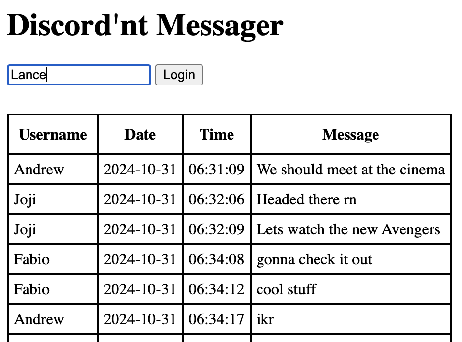

# Distributed Chat Server



## Overview

The Distributed Chat Server is a real-time messaging system built to handle multiple clients communicating with each other over a network. It follows a distributed architecture, allowing users to send and receive messages in a seamless, scalable environment. This server is designed to handle chat functionality, including message storage, user registration, and dynamic updates.

## Features

- Real-time messaging between users
- User registration and management
- Scalable and fault-tolerant architecture
- RESTful API for interacting with the server
- Cookies and Session Management

## Architecture

The server follows a distributed architecture, where messages are stored in blocks, and clients interact through a RESTful API. The system supports the handling of multiple clients simultaneously, ensuring seamless communication.

## REST API

The server exposes a RESTful API for interacting with messages and users. Below is a list of the key API endpoints:

### **1. Messages**

- **GET /api/messages**  
  Fetches all messages.
  
  **Response:**
  ```json
  [
    { "id": 1, "sender": "Alice", "message": "Hello!" },
    { "id": 2, "sender": "Bob", "message": "Hi Alice!" }
  ]
